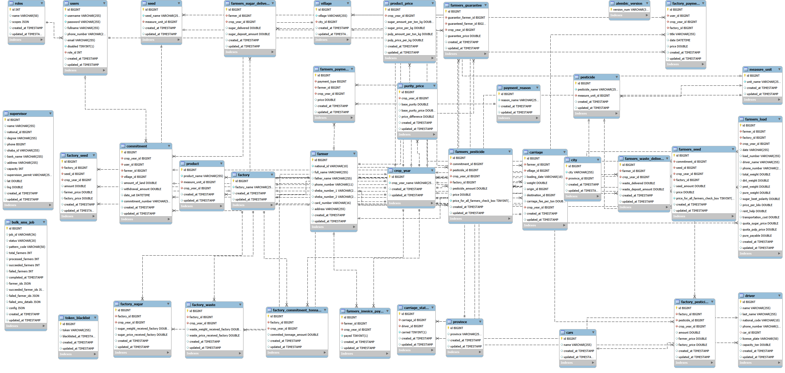

# گزارش پروژه پایانی درس پایگاه داده پیشرفته

**نام و نام خانوادگی: سیدامیرحسین طاهری**
**استاد درس: دکتر آرمین رشنو**
**نیمسال : 4041**
___
**فاز اول:**
از طریق محیط Swagger، همه APIهای سمت سرور بررسی شده و هر کدام تست می‌شوند. در گام اول، لیست همه APIها در یک جدول شامل نام، ورودی، خروجی و ... مستند سازی شود.

تست API های User:
ورودی:
```
`{`
  `"username": "4061234567",`
  `"password": "1234",`
  `"fullname": "Test user99",`
  `"email": "test.user@yahoo.com",`
  `"disabled": false,`
  `"role_id": 1,`
  `"phone_number": "09123456789"`
`}`
```
![[Images/Pasted image 20260209170654.png]]

**خروجی:**
**201 User created successfully**
![[Images/Pasted image 20260209171143.png]]
تست خروجی های ممکن:

**422 Validation error:**

![[Images/Pasted image 20260209171244.png]]

برای ورودی زیر که برای نمونه نام کاربر بصورت عدد و نامعتبر وارد شده انتظار داریم خروجی 422 باشد:
```
 {
  "username": "4061234567",
  "password": "1234",
  "fullname": 55,
  "email": "test.user@yahoo.com",
  "disabled": false,
  "role_id": 1,
  "phone_number": "09123456789"
}
```
و مشاهده میکنیم که خروجی 422  خوهد بود:
![[Images/Pasted image 20260209171959.png]]

**500 Error: response status is 500:**
درصورتی که یوزری تعریف کنیم که قبلا یوزر دیگری با آن نام کابری موجود باشد این ارور مشاهده خواهد شد:
برای ورودی زیر:
```
{
  "username": "4061234567",
  "password": "1234",
  "fullname": "kk",
  "email": "test.user@yahoo.com",
  "disabled": false,
  "role_id": 1,
  "phone_number": "09123456789"
}
```
خروجی:
![[Images/Pasted image 20260209172521.png]]
___
**فاز دوم:**
همه صفحات سمت کاربر بررسی شود و مشخص کنید هر صفحه کدام API را فراخوانی می‌کند. در این مرحله تسلط کافی بر تب‌های مختلف Inspect مرورگر لازم است.

برای نمونه در محیط Inspect و تب Network با وارد کردن یوزرنیم وو پسورد میتوان API مربوط به POST توکن را مشاهده کرد:

![[Images/Pasted image 20260209194048.png]]

و یا با ورود به قسمت عملیات پیمانکار --> ثبت واریزی کارخانه:
مشاهده میکنیم که برخی API ها مانند سال زراعی و فاکتور ها فراخوانی میشوند
![[Images/Pasted image 20260209194450.png]]
و با ایجاد پرداخت کارخانه و ثبت آن API های factory آپدیت شده و مجدد فراخوانی می‌شوند:

![[Images/Pasted image 20260209194627.png]]
___
**فاز سوم:**
لیست همه جداول، فیلدهای هر جدول و ارتباطات بین جداول در اختیار شما قرار می‌گیرد. یک پایگاه داده رابطه ای را پیاده سازی کنید.

برای پیاده‌سازی از MySQL استفاده شده است
تمام جداول و روابط آنها پیاده سازی گردید و خروجی ERD پیاده شده به شکل زیر می‌باشد:




___
**فاز پنجم:** همه عملیات موجود در پایگاه داده رابطه ای و غیر رابطه ای را در قالب یک وب سرویس به صورت API ایجاد کنید.
این کار انجام شده و کد های آن در مسیر app\routers قابل مشاهده هستند.
___
**فاز ششم:** یک دامین ir. تهیه کنید. مدیریت آن را به کلودفلر منتقل کنید.

دامنه amirhosseintaheri80.ir از وبسایت irnic.ir خریداری شد.
حساب کاربری در کلود فلر ساخته شد و آدرس دامنه در به عنوان رکورد DNS در کلودفلر وارد شد.

![[Images/Pasted image 20260209204355.png]]
سپس Nameserver های کلودفلر به دامنه در وبسایت ارائه دهنده دامنه منتقل گردید.
![[Images/Pasted image 20260209204504.png]]

___
**فاز هفتم:** یک سرور مجازی تهیه کنید. وب سرویس را در قالب API بر روی سرور روی دامنه اجرا کنید.
یک سرور مجازی با سیستم عامل لینوکس اوبونتو از وبسایت لیارا تهیه گردید.

___
**فاز هشتم:** از طریق بستر Github فایل های سورس پروژه را از IDE به Repository خود Push کنید. و بر روی سرور حود clone کنید.

فایل های سورس پروژه به ریپازیتوری به آدرس https://github.com/SeAmTa/Havirkesht-Taheri در Github وارد کردیم:
```
git add .
git commit -m "Initial commit"
git push -u origin master

```
 سپس  با ذستور زیر آنها را در سرور کلون کردیم.
```
git clone https://github.com/SeAmTa/Havirkesht-Taheri.git

```

سپس وارد دایرکتوری پروژه شده و یک محیط مجازی ساختیم:
```
cd Havirkesht-Taheri/backend
python3 -m venv venv
source venv/bin/activate

```

پیشنیاز های پروژه روی سرور نصب  شدند: 
Python
MySQL
Uvicorn
Git
Nginx
Certbot

```
sudo apt update
sudo apt install python3 python3-pip python3-dev
sudo apt install mysql-server
sudo mysql_secure_installation
sudo apt install git
....
```

**فاز نهم:** برای دامنه خود گواهی SSL دریافت و نصب کنید. درنهایت اطمینان حاصل کنید که برنامه از طریق HTTPS به صورت ایمن در دسترس است.
همه تنظیمات SSL/TLS در کلودفلر برای دامنه انجام شد
وب سرویس به مدت 3 روز به صورت ایمن از طریق https://amirhosseintaheri80.ir/docs در دسترس بود اما از روز چهارم ارور 502 دریافت گردید.
![[Images/Pasted image 20260209222238.png]]
از طریق IP سرور با لینک https://89.42.199.90/docs به صورت Not secure در دسترس است.
___
**پایان**
